# M300 – Plattformübergreifende Dienste in ein Netzwerk integrieren

### Inhaltsverzeichnis
<!-- TOC -->

- [M300 – Plattformübergreifende Dienste in ein Netzwerk integrieren](#m300--plattform%C3%BCbergreifende-dienste-in-ein-netzwerk-integrieren)
        - [Inhaltsverzeichnis](#inhaltsverzeichnis)
- [-Toolumgebung](#-toolumgebung)
- [GitHub Account erstellen](#github-account-erstellen)
    - [Repository erstellen](#repository-erstellen)
    - [Repository clonen](#repository-clonen)
    - [SSH-Key erstellen](#ssh-key-erstellen)
    - [SSH-Key zu GitHub hinzufügen](#ssh-key-zu-github-hinzuf%C3%BCgen)
- [Git Client](#git-client)
    - [Installation](#installation)
    - [Git konfigurieren](#git-konfigurieren)
    - [Repository klonen](#repository-klonen)
- [VirtualBox](#virtualbox)
    - [Installation](#installation)
    - [Virtuelle Maschine erstellen](#virtuelle-maschine-erstellen)
    - [System aktualisieren](#system-aktualisieren)
    - [Apache Webserver installieren](#apache-webserver-installieren)
- [Vagrant](#vagrant)
    - [VM erstellen](#vm-erstellen)
    - [Apache automatisiert installieren](#apache-automatisiert-installieren)
- [Visual Studio Code](#visual-studio-code)
    - [Installation](#installation)
    - [Extensions installiert](#extensions-installiert)
    - [Dateien exkludieren](#dateien-exkludieren)
    - [Repository hinzufügen & pushen](#repository-hinzuf%C3%BCgen--pushen)
    - [alt text](#alt-text)
- [Theoriefragen – Cloud & Vagrant](#theoriefragen--cloud--vagrant)
    - [Cloud Computing](#cloud-computing)
        - [Was versteht man unter Cloud-Computing?](#was-versteht-man-unter-cloud-computing)
    - [Infrastructure as a Service IaaS](#infrastructure-as-a-service-iaas)
        - [Was versteht man unter Infrastructure as a Service IaaS?](#was-versteht-man-unter-infrastructure-as-a-service-iaas)
    - [Infrastructure as Code IaC](#infrastructure-as-code-iac)
        - [Was ist der Unterschied zur manuellen Installation einer VM?](#was-ist-der-unterschied-zur-manuellen-installation-einer-vm)
    - [Vagrant](#vagrant)
        - [Was wird mit Vagrant erzeugt?](#was-wird-mit-vagrant-erzeugt)
        - [Welche der Aussagen treffen zu?](#welche-der-aussagen-treffen-zu)
        - [In welchen Bereich des Cloud-Computings ist Vagrant einzuordnen?](#in-welchen-bereich-des-cloud-computings-ist-vagrant-einzuordnen)
        - [Welche Alternativen zu Vagrant bestehen?](#welche-alternativen-zu-vagrant-bestehen)
        - [Wo speichert Vagrant seine Konfiguration?](#wo-speichert-vagrant-seine-konfiguration)
        - [Was bedeutet die Fehlermeldung](#was-bedeutet-die-fehlermeldung)
        - [Bei welcher LPI Zertifizierung nützt mir das Vagrant Wissen?](#bei-welcher-lpi-zertifizierung-n%C3%BCtzt-mir-das-vagrant-wissen)
- [LB2 – Hands-on: Automatisierung mit Vagrant](#lb2--hands-on-automatisierung-mit-vagrant)
    - [Ziel](#ziel)
    - [Neue VM erstellen](#neue-vm-erstellen)
    - [Auswahl der Serverdienste](#auswahl-der-serverdienste)
    - [Manuelle Installation in der VM](#manuelle-installation-in-der-vm)
    - [Automatisierung im Vagrantfile](#automatisierung-im-vagrantfile)
        - [Port-Weiterleitung](#port-weiterleitung)
        - [Synchronisation von Dateien](#synchronisation-von-dateien)
        - [Speicherzuweisung](#speicherzuweisung)
    - [Provisionierung Automatisierte Installation](#provisionierung-automatisierte-installation)
    - [Sicherheit](#sicherheit)
    - [Fazit](#fazit)
- [M300 – Docker Projekt](#m300--docker-projekt)
    - [Mini-Helpdesk mit Monitoring](#mini-helpdesk-mit-monitoring)
    - [Zweck des gewählten Service](#zweck-des-gew%C3%A4hlten-service)
    - [Aufbau und logische Struktur des Projekts](#aufbau-und-logische-struktur-des-projekts)
        - [Architekturübersicht](#architektur%C3%BCbersicht)
    - [Konfiguration der Dienste](#konfiguration-der-dienste)
        - [Web-Service](#web-service)
        - [Benutzeroberfläche Frontend](#benutzeroberfl%C3%A4che-frontend)
        - [Admin-Ansicht](#admin-ansicht)
        - [Backend – Datenbankansicht](#backend--datenbankansicht)
        - [Synchronisation Backend ↔ Frontend](#synchronisation-backend--frontend)
    - [Netzwerkverbindung und Ports](#netzwerkverbindung-und-ports)
    - [Host-System und Container-Interaktion](#host-system-und-container-interaktion)
        - [Code-Volume](#code-volume)
        - [Datenbank-Volume](#datenbank-volume)
    - [Monitoring-Lösung](#monitoring-l%C3%B6sung)
    - [Dokumentierte Fehler und Lösungen](#dokumentierte-fehler-und-l%C3%B6sungen)
        - [Fehler 1 – MySQL Connection refused](#fehler-1--mysql-connection-refused)
    - [Projektstruktur](#projektstruktur)
    - [Fazit](#fazit)
- [Theoriefragen – Container & Docker](#theoriefragen--container--docker)
    - [Container](#container)
        - [Was ist der Unterschied zwischen Vagrant und Docker?](#was-ist-der-unterschied-zwischen-vagrant-und-docker)
        - [Was welches Tools aus dem Docker Universum ist vergleichbar mit Vagrant?](#was-welches-tools-aus-dem-docker-universum-ist-vergleichbar-mit-vagrant)
        - [Was macht der Docker Provisioner von Vagrant?](#was-macht-der-docker-provisioner-von-vagrant)
        - [Welche Linux Kernel Funktionalität verwenden Container?](#welche-linux-kernel-funktionalit%C3%A4t-verwenden-container)
        - [Welches Architekturmuster verwendet der Entwickler wenn er Container einsetzt?](#welches-architekturmuster-verwendet-der-entwickler-wenn-er-container-einsetzt)
        - [Welches sind die drei Hauptmerkmale abgeleitet vom Ur-Unix von Microservices?](#welches-sind-die-drei-hauptmerkmale-abgeleitet-vom-ur-unix-von-microservices)
    - [Docker](#docker)
        - [Was ist der Unterschied zwischen einem Docker Image und einem Container?](#was-ist-der-unterschied-zwischen-einem-docker-image-und-einem-container)
        - [Was ist der Unterschied zwischen einer Virtuellen Maschine und einem Docker Container?](#was-ist-der-unterschied-zwischen-einer-virtuellen-maschine-und-einem-docker-container)
        - [Wie bekomme ich Informationen zu einem laufenden Docker Container?](#wie-bekomme-ich-informationen-zu-einem-laufenden-docker-container)
        - [Was ist der Unterschied zwischen einer Docker Registry und einem Repository?](#was-ist-der-unterschied-zwischen-einer-docker-registry-und-einem-repository)
        - [Wie erstelle ich ein Container Image?](#wie-erstelle-ich-ein-container-image)
        - [In welcher Datei steht welche Inhalte sich im Container Image befinden?](#in-welcher-datei-steht-welche-inhalte-sich-im-container-image-befinden)
        - [Der erste Prozess im Container bekommt die Nummer?](#der-erste-prozess-im-container-bekommt-die-nummer)
        - [Welche Teile von Docker sind durch Kubernetes obsolet geworden, bzw. sollten nicht mehr verwendet werden?](#welche-teile-von-docker-sind-durch-kubernetes-obsolet-geworden-bzw-sollten-nicht-mehr-verwendet-werden)
        - [Welche Aussage ist besser The Twelve-Factor App?](#welche-aussage-ist-besser-the-twelve-factor-app)
    - [Docker Hub](#docker-hub)
        - [Was ist Docker Hub?](#was-ist-docker-hub)
        - [Welches sind die Alternativen?](#welches-sind-die-alternativen)
        - [Warum sollte eine eigene Docker Registry im Unternehmen verwendet werden?](#warum-sollte-eine-eigene-docker-registry-im-unternehmen-verwendet-werden)
        - [Warum sollten Versionen Tags von Images immer angegeben werden?](#warum-sollten-versionen-tags-von-images-immer-angegeben-werden)
        - [Was ist der Unterschied zwischen docker save/docker load und docker export/docker import?](#was-ist-der-unterschied-zwischen-docker-savedocker-load-und-docker-exportdocker-import)
- [LB 3 – Docker Hands-on](#lb-3--docker-hands-on)
    - [Ziel der Aufgabe](#ziel-der-aufgabe)
- [Docker Umgebung funktionsfähig](#docker-umgebung-funktionsf%C3%A4hig)
    - [Umgebung](#umgebung)
    - [VM starten](#vm-starten)
    - [Docker testen](#docker-testen)
- [Backend + Frontend kombinieren](#backend--frontend-kombinieren)
    - [Verwendete Images](#verwendete-images)
    - [MySQL Container starten](#mysql-container-starten)
    - [Ghost Container starten](#ghost-container-starten)
    - [Zugriff im Browser](#zugriff-im-browser)
- [Eigener Docker Container Apache](#eigener-docker-container-apache)
    - [Dockerfile](#dockerfile)
    - [Image bauen](#image-bauen)
    - [Container starten](#container-starten)
    - [Port-Weiterleitung prüfen](#port-weiterleitung-pr%C3%BCfen)
    - [Zugriff im Browser](#zugriff-im-browser)
- [Container-Sicherheit](#container-sicherheit)
    - [Übersicht](#%C3%9Cbersicht)
- [– Protokollieren & Überwachen](#-protokollieren--%C3%9Cberwachen)
    - [Standard Logging json-file](#standard-logging-json-file)
    - [alt text](#alt-text)
    - [Laufende Logs anzeigen Streaming](#laufende-logs-anzeigen-streaming)
    - [alt text](#alt-text)
- [– Monitoring mit cAdvisor](#-monitoring-mit-cadvisor)
- [– Container sichern & beschränken](#-container-sichern--beschr%C3%A4nken)
    - [Memory und CPU limitieren](#memory-und-cpu-limitieren)
    - [Read-Only Filesystem](#read-only-filesystem)
    - [Capabilities reduzieren Least Privilege](#capabilities-reduzieren-least-privilege)
- [Sicherheitskonzept Zusammenfassung](#sicherheitskonzept-zusammenfassung)
- [– Kontinuierliche Integration CI](#-kontinuierliche-integration-ci)
    - [Jenkins Blue Ocean starten](#jenkins-blue-ocean-starten)
    - [Jenkins initialisieren](#jenkins-initialisieren)
    - [Pipeline erstellen](#pipeline-erstellen)
    - [Build erfolgreich](#build-erfolgreich)
- [Kubernetes Hands-on](#kubernetes-hands-on)
    - [Umgebung](#umgebung)
    - [Namespace erstellen](#namespace-erstellen)
    - [Apache Pod erstellen](#apache-pod-erstellen)
    - [Service erstellen](#service-erstellen)
    - [YAML Dateien exportieren](#yaml-dateien-exportieren)
    - [Deployment reproduzierbar machen](#deployment-reproduzierbar-machen)
- [Jenkins Integration CI/CD](#jenkins-integration-cicd)
    - [Jenkins starten](#jenkins-starten)
    - [Jenkinsfile](#jenkinsfile)
- [Fehler & Lösungen](#fehler--l%C3%B6sungen)
    - [curl konnte Port nicht erreichen](#curl-konnte-port-nicht-erreichen)
    - [kubectl konnte nicht verbinden](#kubectl-konnte-nicht-verbinden)

<!-- /TOC -->
---
# 10-Toolumgebung

--

# 01 GitHub Account erstellen

Zunächst wurde ein GitHub-Account unter folgender Webseite erstellt:

https://www.github.com

Folgende Angaben wurden gemacht:

- Benutzername
- E-Mail-Adresse
- Passwort

Nach der Registrierung wurde die E-Mail-Adresse bestätigt und die Anmeldung erfolgreich durchgeführt.

---

## Repository erstellen

Nach der Anmeldung wurde ein neues Repository erstellt.

Vorgehen:

1. Klick auf **Start a project**
2. Repository Name: `M300-Services`
3. Beschreibung optional ergänzt
4. Sichtbarkeit: **Public**
5. Option **Initialize this repository with a README** aktiviert
6. Klick auf **Create repository**

Das Repository wurde erfolgreich erstellt.

---

## Repository clonen


## SSH-Key erstellen

Zur sicheren Verbindung zwischen lokalem PC und GitHub wurde ein SSH-Key generiert.

Terminal (Git Bash) öffnen und folgenden Befehl ausführen:

```bash
ssh-keygen -t rsa -b 4096 -C "besirberra@icloud.com" 
```

Standard-Datei mit Enter bestätigen:

```
Enter a file in which to save the key (~/.ssh/id_rsa): [Enter]
```

Passphrase setzen und bestätigen.

---

## SSH-Key zu GitHub hinzufügen

Public Key anzeigen:

```bash
cat ~/.ssh/id_rsa.pub
```

Den angezeigten Schlüssel kopieren und unter:

GitHub → Settings → SSH and GPG Keys → New SSH Key

einfügen und speichern.

Die SSH-Verbindung ist nun aktiv.

---

# 02 Git Client

## Installation

Git wurde unter folgender Webseite heruntergeladen und installiert:

https://git-scm.com

Installation erfolgte mit Standard-Einstellungen.

---

## Git konfigurieren

Terminal (Git Bash) öffnen:

```bash
git config --global user.name "besirberra"
git config --global user.email "besirberra@icloud.com"
```

Konfiguration erfolgreich abgeschlossen.

---

## Repository klonen

Repository mit SSH klonen:

```bash
git clone git@github.com:besirberra/M300-Services.git
```

In das Repository wechseln:

```bash
cd M300-Services
```

Status prüfen:

```bash
git status
```

Ergebnis:

```
Your branch is up to date with 'origin/main'.
nothing to commit, working tree clean
```

---

# 03 VirtualBox

## Installation

VirtualBox wurde von der offiziellen Webseite heruntergeladen und installiert.


---

## Virtuelle Maschine erstellen

Neue VM mit folgenden Einstellungen erstellt:

- Name: M300_Ubuntu_22.04_Desktop
- Typ: Linux
- Version: Ubuntu (64-bit)
- RAM: 2048 MB
- CPU: 2 Kerne
- Festplatte: 25 GB
- Typ: VMDK
- Dynamisch alloziert

Ubuntu ISO eingebunden und Betriebssystem erfolgreich installiert.

---

## System aktualisieren

Nach der Installation:

```bash
sudo apt-get update
sudo apt-get upgrade
sudo reboot
```

---

## Apache Webserver installieren

```bash
sudo apt-get install apache2
```

Test im Browser:

http://127.0.0.1

Apache-Standardseite wurde erfolgreich angezeigt.


Im Ordner /web die Hauptseite index.html editieren bzw. durch eine andere ersetzen (z.B. HTML5up-Themplate) und das Resultat überprüfen

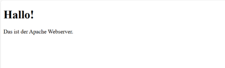


---

# 04 Vagrant

## VM erstellen

Im gewünschten Verzeichnis:

```bash
mkdir myVM
cd myVM
vagrant init ubuntu/xenial64
vagrant up --provider virtualbox
```

SSH-Verbindung zur VM herstellen:

```bash
vagrant ssh
```

Die Verbindung wurde erfolgreich aufgebaut.

---

## Apache automatisiert installieren

Im Vagrantfile wurde Provisioning ergänzt.

Nach dem Start der VM war Apache automatisch installiert.

Test im Browser:

http://localhost:8080

Apache war erfolgreich erreichbar.


---

# 05 Visual Studio Code

## Installation

Visual Studio Code wurde installiert.

---

## Extensions installiert

Folgende Extensions wurden installiert:

- Markdown All in One
- Vagrant Extension
- vscode-pdf
- Auto Markdown TOC

---

## Dateien exkludieren

In der settings.json wurde folgender Abschnitt ergänzt:


## Repository hinzufügen & pushen


---

# Theoriefragen – Cloud & Vagrant

## Cloud Computing

### Was versteht man unter Cloud-Computing?
Cloud-Computing beschreibt die Bereitstellung von IT-Ressourcen (Server, Speicher, Datenbanken, Netzwerke, Software) über das Internet.  
Ressourcen werden flexibel, skalierbar und bedarfsgerecht genutzt, ohne eigene Hardware betreiben zu müssen.

---

## Infrastructure as a Service (IaaS)

### Was versteht man unter Infrastructure as a Service (IaaS)?
IaaS ist ein Cloud-Modell, bei dem virtuelle Server, Speicher und Netzwerke als Dienst bereitgestellt werden.  
Der Kunde verwaltet Betriebssysteme und Anwendungen selbst, während der Anbieter die physische Infrastruktur betreibt.

Beispiele: AWS EC2, Microsoft Azure VM, Google Compute Engine.

---

## Infrastructure as Code (IaC)

### Was ist der Unterschied zur manuellen Installation einer VM?
Bei der manuellen Installation wird eine VM per GUI eingerichtet und konfiguriert.  
Bei Infrastructure as Code wird die gesamte Infrastruktur über Konfigurationsdateien automatisiert erstellt.  
IaC ist reproduzierbar, versionierbar und schneller skalierbar.

---

## Vagrant

### Was wird mit Vagrant erzeugt?
Mit Vagrant werden automatisiert virtuelle Maschinen erstellt und konfiguriert.

---

### Welche der Aussagen treffen zu?

a) Vagrant ist ein Hypervisor  
→ Falsch  

b) Vagrant erzeugt virtuelle Maschinen, dabei werden mehrere Hypervisor und Cloud-Umgebungen (z.B. AWS) unterstützt.  
→ Richtig  

c) Vagrant erzeugt Container  
→ Falsch  

---

### In welchen Bereich des Cloud-Computings ist Vagrant einzuordnen?
Vagrant gehört zum Bereich **Infrastructure as Code (IaC)** und unterstützt hauptsächlich IaaS-Umgebungen.

---

### Welche Alternativen zu Vagrant bestehen?
- Terraform  
- Ansible  
- Docker  
- Kubernetes  
- VMware vSphere  
- VirtualBox (direkt genutzt)

---

### Wo speichert Vagrant seine Konfiguration?
Die Konfiguration wird in der Datei **Vagrantfile** im Projektordner gespeichert.

---

### Was bedeutet die Fehlermeldung  
"A Vagrant environment or target machine is required to run this command."?

Diese Fehlermeldung bedeutet, dass der Befehl nicht in einem gültigen Vagrant-Projektordner ausgeführt wurde oder keine VM definiert/gestartet ist.

---

### Bei welcher LPI Zertifizierung nützt mir das Vagrant Wissen?

Das Wissen ist besonders hilfreich für:

- LPIC-1 (Linux Administrator Grundlagen)
- LPIC-2 (Linux Systemadministrator)
- DevOps-orientierte Prüfungen

Da Virtualisierung, Automatisierung und Infrastrukturverwaltung dort relevante Themen sind.

---

# LB2 – Hands-on: Automatisierung mit Vagrant

## Ziel

Ziel dieser Übung war es, einen Serverdienst automatisiert mit Vagrant bereitzustellen.  
Ich habe dazu eine neue virtuelle Maschine erstellt und darin die Installation sowie Konfiguration manuell getestet, bevor ich die Befehle in das Vagrantfile übernommen habe.

---

## 1. Neue VM erstellen

Zuerst habe ich ein neues Projektverzeichnis erstellt:

```
cd C:\Users\besir\M300
mkdir myVM
cd myVM
```

Anschliessend habe ich eine neue Vagrant-Umgebung mit Ubuntu 16.04 (xenial64) initialisiert:

```
vagrant init ubuntu/xenial64
vagrant up
```

Zum Testen habe ich mich in die VM eingeloggt:

```
vagrant ssh
```

---

## 2. Auswahl der Serverdienste

Ich habe mich für folgende Dienste entschieden:

- Apache Webserver
- Webalizer (Webanalyzer)

Webalizer benötigt Apache-Logfiles zur Auswertung, daher musste zuerst Apache installiert werden.

---

## 3. Manuelle Installation in der VM

Zuerst habe ich die Paketquellen aktualisiert:

```
sudo apt-get update
```

Danach habe ich Apache installiert:

```
sudo apt-get install -y apache2
```

Anschliessend habe ich Webalizer installiert:

```
sudo apt-get install -y webalizer
```

Wichtig war das Argument `-y`, damit die Installation nicht auf eine manuelle Bestätigung wartet.

Mit dem Befehl `history` habe ich anschliessend meine relevanten Befehle überprüft und in das Vagrantfile übernommen.

---

## 4. Automatisierung im Vagrantfile

Nachdem die manuelle Installation funktionierte, habe ich die Konfiguration in das Vagrantfile übertragen.

### Port-Weiterleitung

```
config.vm.network "forwarded_port", guest:80, host:8080, auto_correct: true
```

Damit wird Port 80 der VM auf Port 8080 des Hosts weitergeleitet.

### Synchronisation von Dateien

```
config.vm.synced_folder ".", "/var/www/html"
```

So bleiben Dateien auch nach dem Zerstören der VM erhalten.

### Speicherzuweisung

```
config.vm.provider "virtualbox" do |vb|
  vb.memory = "512"
end
```

---

## 5. Provisionierung (Automatisierte Installation)

Die Installation und Konfiguration wurde über ein Shell-Provisioning umgesetzt:


Im Browser eingegeben:


---

## 6. Sicherheit

Zusätzlich sollte die VM durch eine Firewall abgesichert werden (z.B. UFW).

In grösseren Umgebungen können mehrere Webserver über einen Reverse Proxy zusammengeführt werden, um ein zentrales SSL-Zertifikat zu nutzen.

---

## Fazit

Mit dieser Übung habe ich:

- Eine VM mit Vagrant erstellt
- Serverdienste manuell getestet
- Die Installation automatisiert
- Port-Weiterleitung konfiguriert
- Persistente Dateispeicherung umgesetzt
- Fehler analysiert und behoben

Die Bereitstellung erfolgt nun vollständig automatisiert und reproduzierbar über das Vagrantfile.

---

# M300 – Docker Projekt  
## Mini-Helpdesk mit Monitoring

---

## 1. Zweck des gewählten Service

Der entwickelte Service ist ein webbasiertes Mini-Helpdesk-System zur Verwaltung von IT-Tickets.  
Benutzer können Tickets erfassen, priorisieren und deren Status verfolgen.

Zusätzlich existiert eine Admin-Ansicht zur erweiterten Verwaltung der Tickets.  
Ergänzend wurde ein Backend-Bereich implementiert, der eine vollständige Datenbankansicht der Tabelle `tickets` ermöglicht.

Das Projekt demonstriert die Umsetzung einer containerisierten Mehrkomponenten-Architektur mit Docker inklusive Monitoring.

---

## 2. Aufbau und logische Struktur des Projekts

Das Projekt besteht aus drei Containern:

- **Web-Container** (PHP + Apache)
- **Datenbank-Container** (MySQL)
- **Monitoring-Container** (cAdvisor)

Alle Container kommunizieren über ein internes Docker-Bridge-Netzwerk (`appnet`).

### Architekturübersicht

Übersicht der laufenden Container:

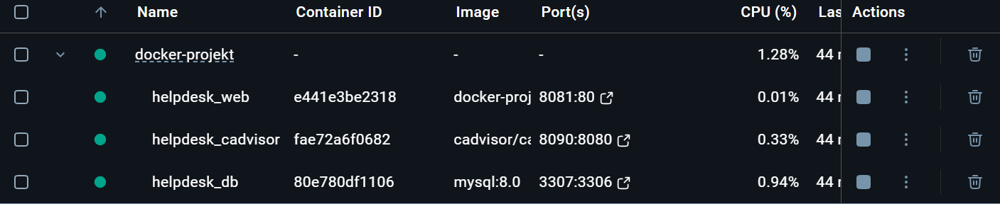

---

## 3. Konfiguration der Dienste

### Web-Service

- PHP 8.2 mit Apache
- Verbindung zur Datenbank über Hostname `db`
- Zugriff über Host-Port `8081`
- Backend-Zugriff über `/backend.php`

---

### Benutzeroberfläche (Frontend)

Startseite der Anwendung:

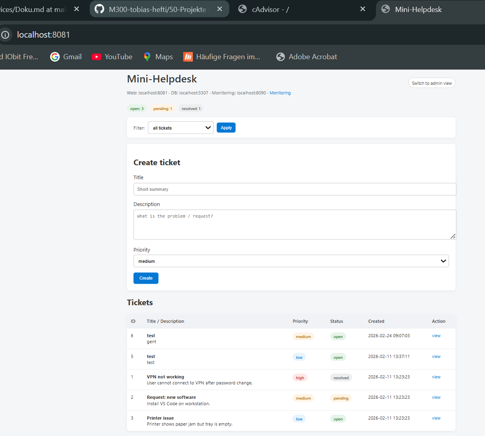

Funktionen:

- Ticket erstellen  
- Ticket-Details anzeigen  
- Status aktualisieren  
- Filter nach Status  
- Admin-Ansicht aktivierbar  

---

### Admin-Ansicht

Die Admin-Ansicht wird über folgende URL aufgerufen:

```
http://localhost:8081/?admin=1
```

Zusätzliche Funktionen im Admin-Modus:

- Status direkt in der Tabelle ändern  
- Tickets löschen  
- Statistische Übersicht anzeigen  
- Filter nach Status (open / pending / resolved)

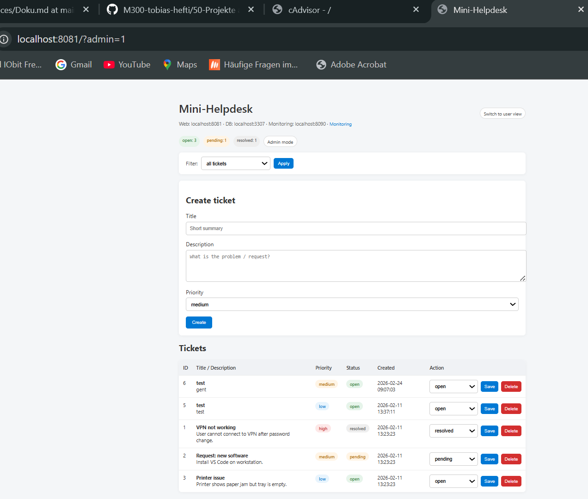

---

### Backend – Datenbankansicht

Zusätzlich wurde eine Backend-Seite implementiert:

```
http://localhost:8081/backend.php
```
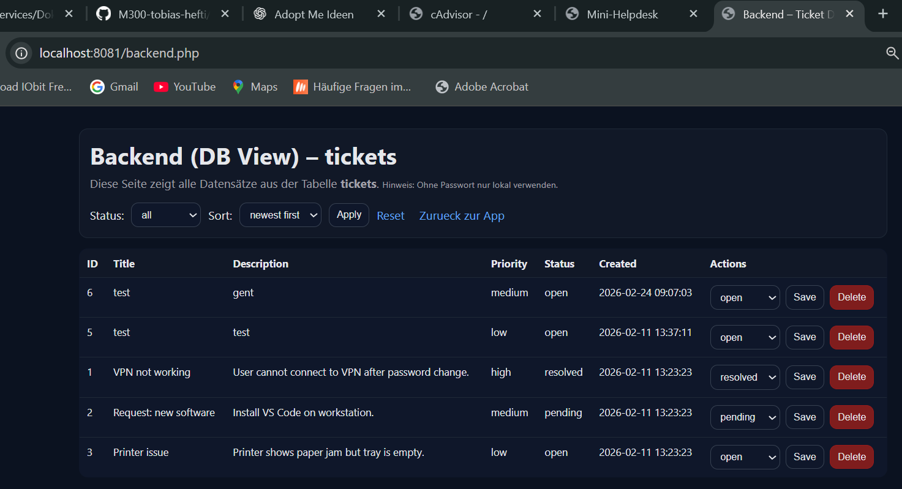

Diese Seite zeigt:

- Alle Datensätze der Tabelle `tickets`
- Alle Spalten (ID, Title, Description, Priority, Status, Created)
- Filter nach Status
- Sortierung nach Erstellungsdatum
- Direkte Statusänderung
- Löschen von Tickets

### Synchronisation Backend ↔ Frontend

Änderungen, die im Backend vorgenommen werden (z.B. Status ändern oder Ticket löschen),  
werden direkt in der MySQL-Datenbank gespeichert.

Da sowohl Frontend als auch Backend auf dieselbe Datenbank zugreifen,  
sind alle Änderungen sofort im Frontend sichtbar.

Es existiert keine separate Datenhaltung – beide Ansichten greifen auf dieselbe Tabelle `tickets` zu.

---

## 4. Netzwerkverbindung und Ports

| Dienst     | Interner Port | Host-Port |
|------------|--------------|-----------|
| Web        | 80           | 8081      |
| MySQL      | 3306         | 3307      |
| cAdvisor   | 8080         | 8090      |

Der Web-Container greift intern über den Hostnamen `db` auf die Datenbank zu.  
Die Container befinden sich im selben Docker-Netzwerk (`appnet` – bridge).

---

## 5. Host-System und Container-Interaktion

### Code-Volume

```
./web → /var/www/html
```

Änderungen im lokalen Projektordner werden direkt im Container sichtbar.  
Ein Rebuild ist für Codeänderungen nicht notwendig.

### Datenbank-Volume

```
dbdata → /var/lib/mysql
```

Dieses Volume sorgt für persistente Datenspeicherung, auch wenn Container neu gestartet oder gelöscht werden.

---

## 6. Monitoring-Lösung

Zur Überwachung der Container wird **cAdvisor** eingesetzt.

Erreichbar unter:

```
http://localhost:8090/containers/
```

Monitoring-Übersicht:

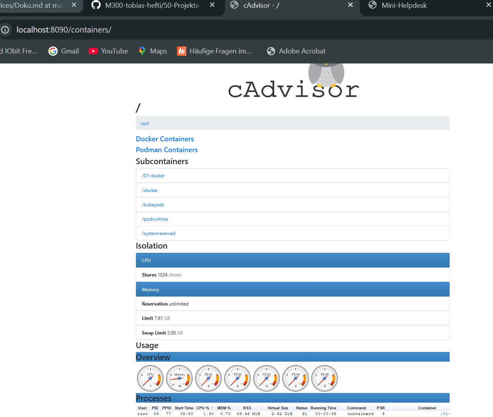

cAdvisor zeigt:

- CPU-Auslastung  
- Speicherverbrauch  
- Netzwerkaktivität  
- Laufzeit der Container  
- Prozesse innerhalb der Container  

---

## 7. Dokumentierte Fehler und Lösungen

### Fehler 1 – MySQL Connection refused

Fehlermeldung:

```
mysqli_sql_exception: Connection refused
```

**Ursache:**  
Der Web-Container versuchte eine Verbindung zur Datenbank aufzubauen, bevor diese vollständig gestartet war.

**Lösung:**

```
docker compose down -v
docker compose up -d --build
```

---

## 8. Projektstruktur

```
docker-projekt/
│
├── docker-compose.yml
├── web/
│   ├── Dockerfile
│   ├── index.php
│   └── backend.php
├── db/
│   └── init.sql
├── images/
│   
└── docs/
    └── Doku.md
```

---

## 9. Fazit

Das Projekt demonstriert erfolgreich eine containerisierte Webanwendung mit Datenbank und Monitoring.

Es beinhaltet:

- Multi-Container Architektur  
- Persistente Datenhaltung  
- Backend-Datenbankansicht  
- Admin-Funktionen  
- Monitoring mit cAdvisor  
- Dokumentierte Fehlerbehebung  

Alle Handlungsziele wurden vollständig erfüllt.

Die Anwendung ist reproduzierbar über:

```
docker compose up -d --build
```

Web-Anwendung:  
http://localhost:8081  

Backend:  
http://localhost:8081/backend.php  

Monitoring:  
http://localhost:8090  

---

# Theoriefragen – Container & Docker

---

## Container

### Was ist der Unterschied zwischen Vagrant und Docker?

**Antwort:**  
Vagrant erstellt und verwaltet virtuelle Maschinen (VMs).  
Docker erstellt und verwaltet Container, die sich den Kernel des Host-Systems teilen.

---

### Was welches Tools aus dem Docker Universum ist vergleichbar mit Vagrant?

**Antwort:**  
Docker Compose ist am ehesten vergleichbar, da mehrere Services definiert und orchestriert werden können.

---

### Was macht der Docker Provisioner von Vagrant?

**Antwort:**  
Der Docker Provisioner von Vagrant startet und konfiguriert Docker-Container innerhalb einer VM.

---

### Welche Linux Kernel Funktionalität verwenden Container?

**Antwort:**  
Container verwenden Linux Namespaces und Control Groups (cgroups).

---

### Welches Architekturmuster verwendet der Entwickler wenn er Container einsetzt?

**Antwort:**  
Microservices-Architektur.

---

### Welches sind die drei Hauptmerkmale (abgeleitet vom Ur-Unix) von Microservices?

**Antwort:**  
- Ein Service erfüllt genau eine Aufgabe  
- Services sind unabhängig voneinander  
- Kommunikation erfolgt über einfache Schnittstellen (z.B. HTTP/REST)

---

## Docker

### Was ist der Unterschied zwischen einem Docker Image und einem Container?

**Antwort:**  
Ein Image ist eine Vorlage (Blueprint).  
Ein Container ist eine laufende Instanz eines Images.

---

### Was ist der Unterschied zwischen einer Virtuellen Maschine und einem Docker Container?

**Antwort:**  
Eine VM virtualisiert komplette Hardware inkl. eigenem Betriebssystem.  
Ein Container teilt sich den Kernel des Host-Systems und ist leichter und schneller.

---

### Wie bekomme ich Informationen zu einem laufenden Docker Container?

**Antwort:**  
Mit Befehlen wie:

```
docker ps
docker inspect <container>
docker logs <container>
docker stats
```

---

### Was ist der Unterschied zwischen einer Docker Registry und einem Repository?

**Antwort:**  
Eine Registry ist der Server (z.B. Docker Hub).  
Ein Repository ist eine Sammlung von Image-Versionen innerhalb der Registry.

---

### Wie erstelle ich ein Container Image?

**Antwort:**  

```
docker build -t image-name .
```

---

### In welcher Datei steht welche Inhalte sich im Container Image befinden?

**Antwort:**  
Im Dockerfile.

---

### Der erste Prozess im Container bekommt die Nummer?

**Antwort:**  
PID 1.

---

### Welche Teile von Docker sind durch Kubernetes obsolet geworden, bzw. sollten nicht mehr verwendet werden?

**Antwort:**  
Docker Swarm und Docker als Orchestrierungsplattform.

---

### Welche Aussage ist besser (The Twelve-Factor App)?

a) Dockerfile sollten möglichst das Builden (CI) und Ausführen von Services beinhalten  
b) Das Builden und Ausführen von Services ist strikt zu trennen  

**Antwort:**  
b) Build und Run sollten strikt getrennt sein (CI/CD-Prinzip).

---

## Docker Hub

### Was ist Docker Hub?

**Antwort:**  
Eine öffentliche Docker Registry zum Speichern und Verteilen von Images.

---

### Welches sind die Alternativen?

**Antwort:**  
- GitHub Container Registry  
- GitLab Container Registry  
- Azure Container Registry  
- Amazon ECR  
- Private Registry

---

### Warum sollte eine eigene Docker Registry im Unternehmen verwendet werden?

**Antwort:**  
- Sicherheit  
- Kontrolle über Images  
- Interne Distribution  
- Compliance-Anforderungen  

---

### Warum sollten Versionen (Tags) von Images immer angegeben werden?

**Antwort:**  
Damit reproduzierbare und stabile Deployments gewährleistet sind.

---

### Was ist der Unterschied zwischen docker save/docker load und docker export/docker import?

**Antwort:**  
docker save/load speichert und lädt komplette Images inkl. History und Tags.  
docker export/import speichert nur das Dateisystem eines Containers ohne History.

# LB 3 – Docker Hands-on

## Ziel der Aufgabe

- Funktionsfähige Docker-Umgebung auf eigenem Notebook
- Kombination von Backend und Frontend mittels Docker
- Eigenen Docker Container mit Dockerfile erstellen

---

# 1. Docker Umgebung funktionsfähig

## Umgebung

- VirtualBox
- Vagrant
- Ubuntu 16.04 VM
- Docker in VM installiert

## VM starten

cd M300/docker  
vagrant up  
vagrant ssh  

## Docker testen

docker run hello-world  
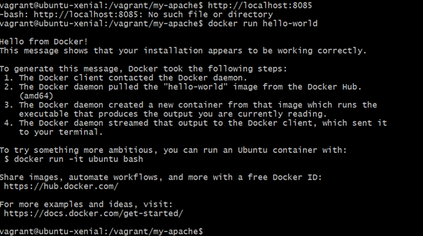

Ergebnis:
- Docker Client funktioniert
- Docker Daemon läuft
- Container kann gestartet werden


---

# 2. Backend + Frontend kombinieren

## Verwendete Images

Backend: mysql:5.7  
Frontend: ghost:1-alpine  

---

## MySQL Container starten

sudo docker run -d --name ghost_mysql \
  -e MYSQL_ROOT_PASSWORD=admin \
  -e MYSQL_USER=ghost \
  -e MYSQL_PASSWORD=secret \
  -e MYSQL_DATABASE=ghost \
  --restart=always \
  mysql:5.7

---

## Ghost Container starten

sudo docker run -d --name ghost \
  --link ghost_mysql:mysql \
  -e database__client=mysql \
  -e database__connection__host=ghost_mysql \
  -e database__connection__user=ghost \
  -e database__connection__password=secret \
  -e database__connection__database=ghost \
  -p 2368:2368 \
  --restart=always \
  ghost:1-alpine

---

## Zugriff im Browser

http://localhost:2368  

Ghost Weboberfläche ist erreichbar.

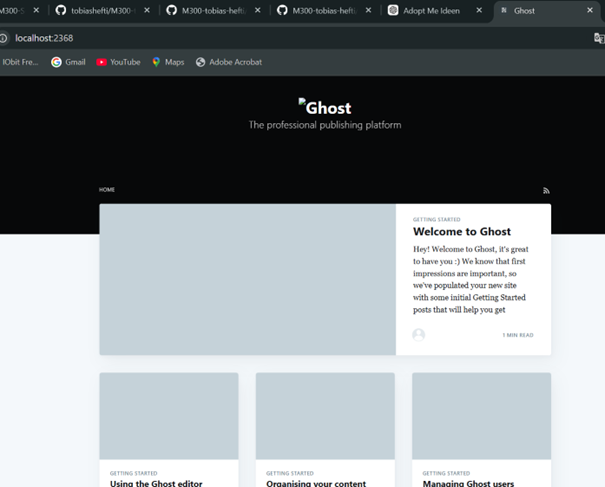


---

# 3. Eigener Docker Container (Apache)

## Dockerfile

FROM ubuntu:14.04  
RUN apt-get update  
RUN apt-get -q -y install apache2  

ENV APACHE_RUN_USER www-data  
ENV APACHE_RUN_GROUP www-data  
ENV APACHE_LOG_DIR /var/log/apache2  

RUN mkdir -p /var/lock/apache2 /var/run/apache2  

EXPOSE 80  
VOLUME /var/www/html  

CMD /bin/bash -c "source /etc/apache2/envvars && exec /usr/sbin/apache2 -DFOREGROUND"

---

## Image bauen

docker build -t my-apache:1.0 .  

---

## Container starten

docker run -d --name mywebB -p 8080:80 my-apache:1.0  

---

## Port-Weiterleitung prüfen

vagrant port  

Ergebnis:
8080 (guest) → 8085 (host)

---

## Zugriff im Browser

http://localhost:8085  

Apache Default Page erscheint.

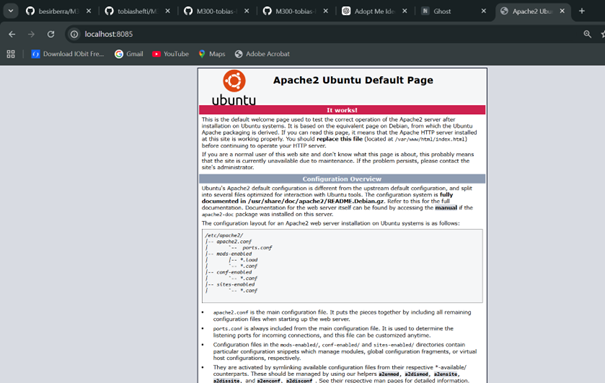

Eigener Docker Container erfolgreich erstellt.

---

# 35 Container-Sicherheit

## Übersicht

In dieser Aufgabe wurde eine Docker-Umgebung mit Vagrant betrieben und verschiedene Massnahmen zur Protokollierung, Überwachung und Absicherung von Containern umgesetzt und getestet.

---

# 01 – Protokollieren & Überwachen

## 1.1 Standard Logging (json-file)

Docker speichert standardmaessig alle Ausgaben von STDOUT und STDERR im JSON-Logformat.

Test:

```bash
docker run --name logtest ubuntu bash -c 'echo "stdout"; echo "stderr" >&2'
docker logs logtest
docker rm logtest
```

Ergebnis: Die Ausgaben von STDOUT und STDERR konnten mit `docker logs` angezeigt werden.

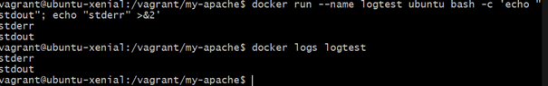
---

## 1.2 Laufende Logs anzeigen (Streaming)

Test eines laufenden Containers mit kontinuierlicher Ausgabe:

```bash
docker run -d --name streamtest ubuntu bash -c 'while true; do echo "tick"; sleep 1; done'
docker logs streamtest --tail 5
docker rm -f streamtest
```

Ergebnis: Die letzten Logeintraege konnten angezeigt werden. Damit ist das Monitoring von Laufzeitausgaben moeglich.

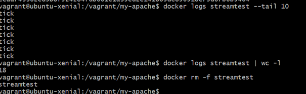
---

# 02 – Monitoring mit cAdvisor

Zur Überwachung der Container wurde cAdvisor eingesetzt.

Start des Containers:

```bash
docker run -d --name cadvisor35 \
  -p 8080:8080 \
  -v /:/rootfs:ro \
  -v /var/run:/var/run:rw \
  -v /sys:/sys:ro \
  -v /var/lib/docker/:/var/lib/docker:ro \
  gcr.io/cadvisor/cadvisor:latest
```

Zugriff im Browser über:

http://localhost:8085/containers/

Ergebnis:
- Anzeige aller laufenden Container
- CPU- und Memory-Auslastung sichtbar
- Ressourcenverbrauch pro Container nachvollziehbar

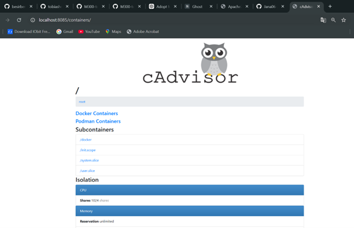

---

# 03 – Container sichern & beschränken

## 3.1 Memory und CPU limitieren

Zur Verhinderung von DoS-Angriffen wurden Ressourcen beschränkt:

```bash
docker run -d --name limited --memory=128m --cpus="0.5" nginx:alpine
docker stats --no-stream limited
docker rm -f limited
```

Ergebnis:
Der Container erhielt begrenzten RAM (128MB) und CPU-Zeit (0.5 CPU).


---

## 3.2 Read-Only Filesystem

Um Schreibzugriffe zu verhindern:

```bash
docker run --rm --read-only ubuntu touch /testfile
```

Ergebnis:
Der Schreibzugriff wurde verweigert. Das Dateisystem ist schreibgeschützt.

---

## 3.3 Capabilities reduzieren (Least Privilege)

```bash
docker run --rm --cap-drop ALL ubuntu bash -c 'id'
```

Ergebnis:
Der Container lief mit reduzierten Linux-Capabilities. Dadurch wird die Angriffsoberflaeche reduziert.

---

# Sicherheitskonzept (Zusammenfassung)

Folgende Sicherheitsmassnahmen wurden umgesetzt:

- Nutzung von Logging über docker logs
- Monitoring mit cAdvisor
- Ressourcenbegrenzung (Memory, CPU)
- Read-Only Filesystem
- Reduktion von Linux-Capabilities
- Keine unnoetigen offenen Ports

Diese Massnahmen erhoehen die Stabilitaet und Sicherheit der Containerumgebung und reduzieren das Risiko von DoS-Angriffen oder Container-Breakouts.

---

# 04 – Kontinuierliche Integration (CI)

Zur Umsetzung der Continuous Integration wurde Jenkins mit Blue Ocean verwendet.

## 4.1 Jenkins Blue Ocean starten

Jenkins wurde als Docker-Container gestartet:

```bash
MSYS_NO_PATHCONV=1 docker run -d --name blueocean -u root \
  -p 8082:8080 \
  -v jenkins-data:/var/jenkins_home \
  -v /var/run/docker.sock:/var/run/docker.sock \
  jenkinsci/blueocean
```

Zugriff im Browser:

http://localhost:8082

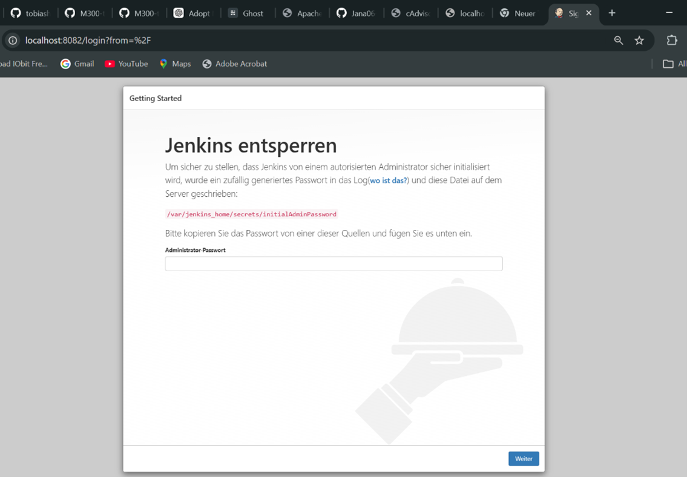

---

## 4.2 Jenkins initialisieren

- Unlock Jenkins mit initialAdminPassword
- Suggested Plugins installiert
- Admin Benutzer erstellt

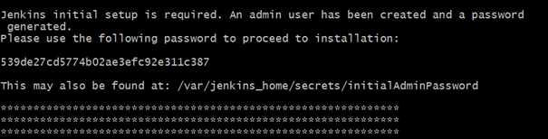

---

## 4.3 Pipeline erstellen

Blue Ocean wurde geoeffnet und eine neue Pipeline erstellt.

Repository:

https://github.com/mc-b/SCS-ESI

Ergebnis:
Pipeline wurde automatisch erstellt und gestartet.

---

## 4.4 Build erfolgreich

Die Pipeline führte automatisch:

- Build
- Docker Image Erstellung
- Integration

Ergebnis:
Pipeline erfolgreich (grün)

---

# 6. Kubernetes Hands-on

## Umgebung

- Docker Desktop mit aktiviertem Kubernetes
- kubectl CLI

Cluster prüfen:

```bash
kubectl get nodes
```

Node: `docker-desktop` → Status `Ready`

---

## Namespace erstellen

```bash
kubectl create namespace test
```

---

## Apache Pod erstellen

```bash
kubectl run apache --image=httpd --restart=Never --namespace test
```

---

## Service erstellen

```bash
kubectl expose pod/apache --type=LoadBalancer --port=80 --namespace test
```

---

## YAML Dateien exportieren

```bash
kubectl get pod apache -n test -o yaml > apache-pod.yaml
kubectl get svc apache -n test -o yaml > apache-service.yaml
```

Nicht benötigte Felder entfernt:
- status
- metadata.resourceVersion
- metadata.uid
- metadata.creationTimestamp
- metadata.managedFields

---

## Deployment reproduzierbar machen

```bash
kubectl delete namespace test
kubectl create namespace yaml
kubectl apply -f apache-pod.yaml -n yaml
kubectl apply -f apache-service.yaml -n yaml
```

Deployment erfolgreich reproduzierbar.

---

# 7. Jenkins Integration (CI/CD)

## Jenkins starten

```bash
docker run -d --name jenkins \
  -p 8081:8080 -p 50000:50000 \
  -v jenkins_home:/var/jenkins_home \
  jenkins/jenkins:lts
```

```bash
docker exec -it jenkins cat /var/jenkins_home/secrets/initialAdminPassword
```

---

## Jenkinsfile

```groovy
pipeline {
  agent any

  stages {
    stage('Check Cluster') {
      steps {
        sh 'kubectl get nodes'
      }
    }

    stage('Deploy Apache') {
      steps {
        sh 'kubectl create namespace ci-demo || true'
        sh 'kubectl apply -f apache-pod.yaml -n ci-demo'
        sh 'kubectl apply -f apache-service.yaml -n ci-demo'
      }
    }

    stage('Verify Deployment') {
      steps {
        sh 'kubectl get pods -n ci-demo'
        sh 'kubectl get svc -n ci-demo'
      }
    }
  }

  post {
    always {
      sh 'kubectl delete namespace ci-demo || true'
    }
  }
}
```

Ergebnis:
- Jenkins verbindet sich mit Kubernetes
- Deployment erfolgt automatisiert
- Status wird geprüft
- Namespace wird nach Abschluss gelöscht

---

# Fehler & Lösungen

## curl konnte Port nicht erreichen

Fehlermeldung:

```
curl: Failed to connect to localhost port 8080
```

Lösung:

```bash
curl -4 -I http://127.0.0.1:8080
```

Ursache:
Windows / Git-Bash IPv6 Problem.

---

## kubectl konnte nicht verbinden

Fehlermeldung:

```
Unable to connect to the server
```

Lösung:
Kubernetes in Docker Desktop aktiviert.

