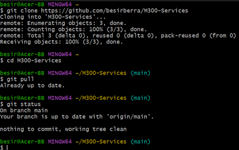
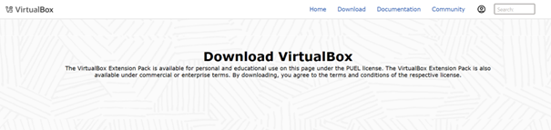
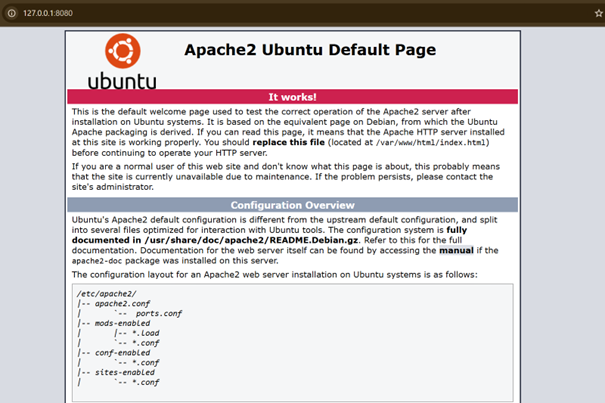
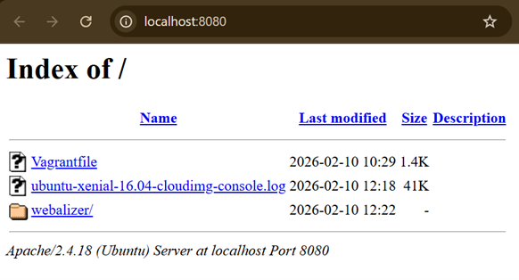
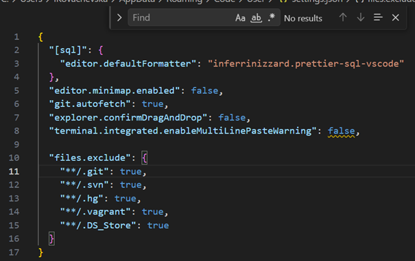
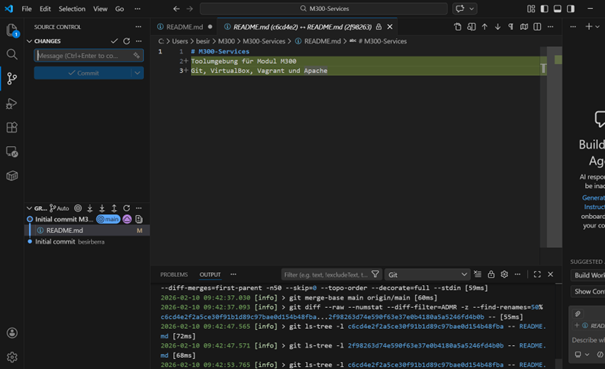
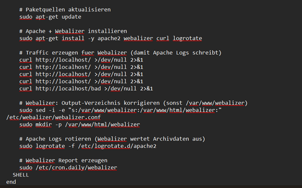
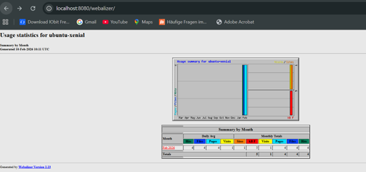
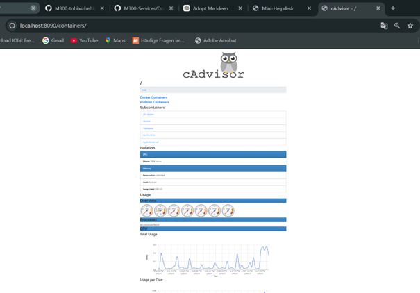

# M300 – Plattformübergreifende Dienste in ein Netzwerk integrieren

---

## GitHub Account erstellen

Zunächst wurde ein GitHub-Account unter folgender Webseite erstellt:

https://www.github.com

Folgende Angaben wurden gemacht:

- Benutzername
- E-Mail-Adresse
- Passwort

Nach der Registrierung wurde die E-Mail-Adresse bestätigt und die Anmeldung erfolgreich durchgeführt.

---

## Repository erstellen

Nach der Anmeldung wurde ein neues Repository erstellt.

Vorgehen:

1. Klick auf **Start a project**
2. Repository Name: `M300-Services`
3. Beschreibung optional ergänzt
4. Sichtbarkeit: **Public**
5. Option **Initialize this repository with a README** aktiviert
6. Klick auf **Create repository**

Das Repository wurde erfolgreich erstellt.

---

## Repository clonen


## SSH-Key erstellen

Zur sicheren Verbindung zwischen lokalem PC und GitHub wurde ein SSH-Key generiert.

Terminal (Git Bash) öffnen und folgenden Befehl ausführen:

```bash
ssh-keygen -t rsa -b 4096 -C "besirberra@icloud.com" 
```

Standard-Datei mit Enter bestätigen:

```
Enter a file in which to save the key (~/.ssh/id_rsa): [Enter]
```

Passphrase setzen und bestätigen.

---

## SSH-Key zu GitHub hinzufügen

Public Key anzeigen:

```bash
cat ~/.ssh/id_rsa.pub
```

Den angezeigten Schlüssel kopieren und unter:

GitHub → Settings → SSH and GPG Keys → New SSH Key

einfügen und speichern.

Die SSH-Verbindung ist nun aktiv.

---

# – Git Client

## Installation

Git wurde unter folgender Webseite heruntergeladen und installiert:

https://git-scm.com

Installation erfolgte mit Standard-Einstellungen.

---

## Git konfigurieren

Terminal (Git Bash) öffnen:

```bash
git config --global user.name "besirberra"
git config --global user.email "besirberra@icloud.com"
```

Konfiguration erfolgreich abgeschlossen.

---

## Repository klonen

Repository mit SSH klonen:

```bash
git clone git@github.com:besirberra/M300-Services.git
```

In das Repository wechseln:

```bash
cd M300-Services
```

Status prüfen:

```bash
git status
```

Ergebnis:

```
Your branch is up to date with 'origin/main'.
nothing to commit, working tree clean
```

---

# – VirtualBox

## Installation

VirtualBox wurde von der offiziellen Webseite heruntergeladen und installiert.


---

## Virtuelle Maschine erstellen

Neue VM mit folgenden Einstellungen erstellt:

- Name: M300_Ubuntu_22.04_Desktop
- Typ: Linux
- Version: Ubuntu (64-bit)
- RAM: 2048 MB
- CPU: 2 Kerne
- Festplatte: 25 GB
- Typ: VMDK
- Dynamisch alloziert

Ubuntu ISO eingebunden und Betriebssystem erfolgreich installiert.

---

## System aktualisieren

Nach der Installation:

```bash
sudo apt-get update
sudo apt-get upgrade
sudo reboot
```

---

## Apache Webserver installieren

```bash
sudo apt-get install apache2
```

Test im Browser:

http://127.0.0.1

Apache-Standardseite wurde erfolgreich angezeigt.



---

# – Vagrant

## VM erstellen

Im gewünschten Verzeichnis:

```bash
mkdir myVM
cd myVM
vagrant init ubuntu/xenial64
vagrant up --provider virtualbox
```

SSH-Verbindung zur VM herstellen:

```bash
vagrant ssh
```

Die Verbindung wurde erfolgreich aufgebaut.

---

## Apache automatisiert installieren

Im Vagrantfile wurde Provisioning ergänzt.

Nach dem Start der VM war Apache automatisch installiert.

Test im Browser:

http://localhost:8080

Apache war erfolgreich erreichbar.



---

# – Visual Studio Code

## Installation

Visual Studio Code wurde installiert.

---

## Extensions installiert

Folgende Extensions wurden installiert:

- Markdown All in One
- Vagrant Extension
- vscode-pdf
- Auto Markdown TOC

---

## Dateien exkludieren

In der settings.json wurde folgender Abschnitt ergänzt:



## Repository hinzufügen & pushen


---

# Theoriefragen – Cloud & Vagrant

## Cloud Computing

### Was versteht man unter Cloud-Computing?
Cloud-Computing beschreibt die Bereitstellung von IT-Ressourcen (Server, Speicher, Datenbanken, Netzwerke, Software) über das Internet.  
Ressourcen werden flexibel, skalierbar und bedarfsgerecht genutzt, ohne eigene Hardware betreiben zu müssen.

---

## Infrastructure as a Service (IaaS)

### Was versteht man unter Infrastructure as a Service (IaaS)?
IaaS ist ein Cloud-Modell, bei dem virtuelle Server, Speicher und Netzwerke als Dienst bereitgestellt werden.  
Der Kunde verwaltet Betriebssysteme und Anwendungen selbst, während der Anbieter die physische Infrastruktur betreibt.

Beispiele: AWS EC2, Microsoft Azure VM, Google Compute Engine.

---

## Infrastructure as Code (IaC)

### Was ist der Unterschied zur manuellen Installation einer VM?
Bei der manuellen Installation wird eine VM per GUI eingerichtet und konfiguriert.  
Bei Infrastructure as Code wird die gesamte Infrastruktur über Konfigurationsdateien automatisiert erstellt.  
IaC ist reproduzierbar, versionierbar und schneller skalierbar.

---

## Vagrant

### Was wird mit Vagrant erzeugt?
Mit Vagrant werden automatisiert virtuelle Maschinen erstellt und konfiguriert.

---

### Welche der Aussagen treffen zu?

a) Vagrant ist ein Hypervisor  
→ Falsch  

b) Vagrant erzeugt virtuelle Maschinen, dabei werden mehrere Hypervisor und Cloud-Umgebungen (z.B. AWS) unterstützt.  
→ Richtig  

c) Vagrant erzeugt Container  
→ Falsch  

---

### In welchen Bereich des Cloud-Computings ist Vagrant einzuordnen?
Vagrant gehört zum Bereich **Infrastructure as Code (IaC)** und unterstützt hauptsächlich IaaS-Umgebungen.

---

### Welche Alternativen zu Vagrant bestehen?
- Terraform  
- Ansible  
- Docker  
- Kubernetes  
- VMware vSphere  
- VirtualBox (direkt genutzt)

---

### Wo speichert Vagrant seine Konfiguration?
Die Konfiguration wird in der Datei **Vagrantfile** im Projektordner gespeichert.

---

### Was bedeutet die Fehlermeldung  
"A Vagrant environment or target machine is required to run this command."?

Diese Fehlermeldung bedeutet, dass der Befehl nicht in einem gültigen Vagrant-Projektordner ausgeführt wurde oder keine VM definiert/gestartet ist.

---

### Bei welcher LPI Zertifizierung nützt mir das Vagrant Wissen?

Das Wissen ist besonders hilfreich für:

- LPIC-1 (Linux Administrator Grundlagen)
- LPIC-2 (Linux Systemadministrator)
- DevOps-orientierte Prüfungen

Da Virtualisierung, Automatisierung und Infrastrukturverwaltung dort relevante Themen sind.

---

# LB2 – Hands-on: Automatisierung mit Vagrant

## Ziel

Ziel dieser Übung war es, einen Serverdienst automatisiert mit Vagrant bereitzustellen.  
Ich habe dazu eine neue virtuelle Maschine erstellt und darin die Installation sowie Konfiguration manuell getestet, bevor ich die Befehle in das Vagrantfile übernommen habe.

---

## 1. Neue VM erstellen

Zuerst habe ich ein neues Projektverzeichnis erstellt:

```
cd C:\Users\besir\M300
mkdir myVM
cd myVM
```

Anschliessend habe ich eine neue Vagrant-Umgebung mit Ubuntu 16.04 (xenial64) initialisiert:

```
vagrant init ubuntu/xenial64
vagrant up
```

Zum Testen habe ich mich in die VM eingeloggt:

```
vagrant ssh
```

---

## 2. Auswahl der Serverdienste

Ich habe mich für folgende Dienste entschieden:

- Apache Webserver
- Webalizer (Webanalyzer)

Webalizer benötigt Apache-Logfiles zur Auswertung, daher musste zuerst Apache installiert werden.

---

## 3. Manuelle Installation in der VM

Zuerst habe ich die Paketquellen aktualisiert:

```
sudo apt-get update
```

Danach habe ich Apache installiert:

```
sudo apt-get install -y apache2
```

Anschliessend habe ich Webalizer installiert:

```
sudo apt-get install -y webalizer
```

Wichtig war das Argument `-y`, damit die Installation nicht auf eine manuelle Bestätigung wartet.

Mit dem Befehl `history` habe ich anschliessend meine relevanten Befehle überprüft und in das Vagrantfile übernommen.

---

## 4. Automatisierung im Vagrantfile

Nachdem die manuelle Installation funktionierte, habe ich die Konfiguration in das Vagrantfile übertragen.

### Port-Weiterleitung

```
config.vm.network "forwarded_port", guest:80, host:8080, auto_correct: true
```

Damit wird Port 80 der VM auf Port 8080 des Hosts weitergeleitet.

### Synchronisation von Dateien

```
config.vm.synced_folder ".", "/var/www/html"
```

So bleiben Dateien auch nach dem Zerstören der VM erhalten.

### Speicherzuweisung

```
config.vm.provider "virtualbox" do |vb|
  vb.memory = "512"
end
```

---

## 5. Provisionierung (Automatisierte Installation)

Die Installation und Konfiguration wurde über ein Shell-Provisioning umgesetzt:



Im Browser eingegeben:



---

## 6. Sicherheit

Zusätzlich sollte die VM durch eine Firewall abgesichert werden (z.B. UFW).

In grösseren Umgebungen können mehrere Webserver über einen Reverse Proxy zusammengeführt werden, um ein zentrales SSL-Zertifikat zu nutzen.

---

## Fazit

Mit dieser Übung habe ich:

- Eine VM mit Vagrant erstellt
- Serverdienste manuell getestet
- Die Installation automatisiert
- Port-Weiterleitung konfiguriert
- Persistente Dateispeicherung umgesetzt
- Fehler analysiert und behoben

Die Bereitstellung erfolgt nun vollständig automatisiert und reproduzierbar über das Vagrantfile.

---

# Mini-Helpdesk (Docker-Projekt)

## Zweck des Projekts

Das Projekt „Mini-Helpdesk“ demonstriert eine containerisierte Webanwendung mit angebundener SQL-Datenbank unter Verwendung von Docker Compose.  

Ziel ist es, folgende Aspekte praktisch umzusetzen:

- Multi-Container-Architektur
- Container-Kommunikation über internes Netzwerk
- Port-Konfiguration
- Persistenz mittels Docker-Volumes
- Monitoring-Lösung
- Trennung zwischen Benutzer- und Admin-Ansicht
- Fehleranalyse und Fehlerbehebung

---

## Projektarchitektur

Die Anwendung besteht aus drei Services:

### 1️ Web-Container
- PHP 8.2 mit Apache
- Stellt die Benutzeroberfläche zur Verfügung
- Erlaubt das Erstellen, Anzeigen und Bearbeiten von Tickets
- Kommuniziert intern mit dem Datenbank-Container

### 2️ Datenbank-Container
- MySQL 8.0
- Speichert alle Ticketdaten
- Nutzt ein benanntes Volume für persistente Datenspeicherung

### 3️ Monitoring (cAdvisor)
- Überwacht Container-Ressourcen
- Zeigt CPU-, RAM-, Netzwerk- und I/O-Werte an

Alle Container sind über ein Docker-Bridge-Netzwerk (`appnet`) miteinander verbunden.

---

## Netzwerk & Ports

| Service     | Interner Port | Host-Port |
|------------|--------------|----------|
| Web        | 80           | 8081     |
| MySQL      | 3306         | 3307     |
| cAdvisor   | 8080         | 8090     |

---

## Volumes (Host ↔ Container Interaktion)

### Code-Volume
```
./web → /var/www/html
```
Änderungen im Projektordner werden sofort im Container sichtbar.

### Datenbank-Volume
```
dbdata → /var/lib/mysql
```
Sorgt für persistente Speicherung der Daten auch nach Neustarts.

---

## Datenbankstruktur

### Tabelle: `tickets`

| Spalte       | Typ |
|--------------|------|
| id           | INT (Primärschlüssel, AUTO_INCREMENT) |
| title        | VARCHAR(120) |
| description  | TEXT |
| priority     | ENUM(low, medium, high) |
| status       | ENUM(open, pending, resolved) |
| created_at   | TIMESTAMP |

---

## Funktionen der Anwendung

### Benutzeransicht
- Ticket erstellen
- Ticketliste anzeigen
- Detailansicht eines Tickets öffnen
- Status ändern (open / pending / resolved)

### Helpdesk

Aufruf über:

```
http://localhost:8081

images/Bild17.png

Zusätzliche Funktionen:
- Übersichtliche Statistik (open / pending / resolved)
- Status direkt in der Tabelle ändern
- Tickets löschen
- Visuelle Kennzeichnung des Admin-Modus

---

## Monitoring

Das Monitoring wird über **cAdvisor** realisiert.

Erreichbar unter:

```
http://localhost:8090/containers/




cAdvisor zeigt:
- CPU-Auslastung
- Speicherverbrauch
- Netzwerkaktivität
- Laufzeit der Container

Damit wird das Infrastruktur-Monitoring der Container demonstriert.

---

## Dokumentierter Fehler & Lösung

### Fehler:
```
mysqli_sql_exception: Connection refused
```

### Ursache:
Der Web-Container versuchte eine Verbindung zur Datenbank aufzubauen, bevor der MySQL-Container vollständig gestartet war.

### Lösung:
Container wurden neu gestartet und Volumes zurückgesetzt:

```
docker compose down -v
docker compose up -d --build
```

Zusätzlich wurden Containerstatus und Logs überprüft:

```
docker compose ps
docker compose logs
```

---

## ▶ Projekt starten

```
docker compose up -d --build
```

Webanwendung:
```
http://localhost:8081
```

Monitoring:
```
http://localhost:8090
```

---

## Projektstruktur

```
docker-projekt/
│
├── docker-compose.yml
├── web/
│   ├── Dockerfile
│   └── index.php
├── db/
│   └── init.sql
└── docs/
    └── README.md
```

---

## ✅ Fazit

Das Projekt erfüllt alle definierten Handlungsziele:

- Dienst konfiguriert und deployt
- Netzwerkverbindung eingerichtet
- Ports definiert
- Host-Container-Interaktion mittels Volumes
- Monitoring-Lösung integriert
- Fehler dokumentiert und behoben
- Erweiterte Admin-Funktionalität umgesetzt

Die Anwendung stellt eine vollständige, funktionierende Multi-Container-Umgebung mit Docker dar.